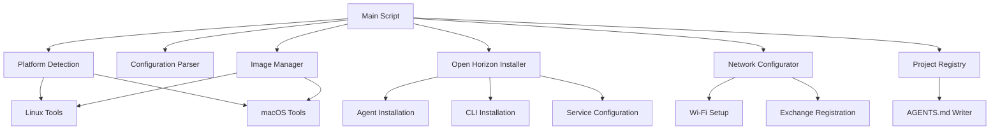

# Design Document: Raspberry Pi Image Builder

## Overview

The Raspberry Pi Image Builder is a cross-platform bash script system that creates custom SD card images with embedded Open Horizon components. The system uses platform-specific tools (Linux `losetup`/`mount` vs macOS `hdiutil`) to mount and modify base Raspberry Pi OS images, then installs the Open Horizon anax agent and CLI with optional exchange registration and Wi-Fi configuration.

The design follows a modular approach with separate components for image mounting, Open Horizon installation, configuration management, and project persistence. All operations are performed on mounted filesystem images without requiring physical Raspberry Pi hardware.

## Architecture



## Components and Interfaces

### Platform Detection Module
**Purpose**: Detect operating system and select appropriate tools
**Interface**:
```bash
detect_platform() -> "linux" | "macos"
check_dependencies() -> exit_code
```

**Linux Dependencies**: `losetup`, `mount`, `umount`, `kpartx`, `chroot`, `wget`, `curl`
**macOS Dependencies**: `hdiutil`, `diskutil`, `wget`, `curl`

### Image Manager Module
**Purpose**: Handle mounting, unmounting, and modification of disk images
**Interface**:
```bash
mount_image(image_path, mount_point) -> loop_device
unmount_image(loop_device, mount_point) -> exit_code
resize_image(image_path, new_size) -> exit_code
verify_image(image_path) -> exit_code
```

**Linux Implementation**: Uses `losetup -P` for partition probing and standard `mount` commands
**macOS Implementation**: Uses `hdiutil attach` and `diskutil` for mounting operations

### Open Horizon Installer Module
**Purpose**: Install and configure Open Horizon components within mounted image
**Interface**:
```bash
install_anax_agent(chroot_path, version) -> exit_code
install_horizon_cli(chroot_path, version) -> exit_code
configure_agent_service(chroot_path) -> exit_code
```

**Implementation Strategy**: 
- Download Open Horizon packages from official repositories
- Use `chroot` environment to install packages as if running on target system
- Configure systemd services for automatic startup
- Handle ARM emulation on x86 systems using `qemu-user-static`

### Network Configurator Module
**Purpose**: Configure Wi-Fi and exchange registration using cloud-init
**Interface**:
```bash
configure_wifi(chroot_path, ssid, password, security) -> exit_code
configure_exchange_registration(chroot_path, exchange_url, credentials, node_json_path) -> exit_code
setup_cloud_init(chroot_path, config_data) -> exit_code
create_firstrun_script(chroot_path, registration_config) -> exit_code
```

**Wi-Fi Configuration**: Modifies `/etc/wpa_supplicant/wpa_supplicant.conf` and enables networking services
**Exchange Registration**: Creates cloud-init configuration and firstrun.sh script that registers device with exchange on initial startup after network connectivity is established. Supports custom `node.json` file or falls back to default configuration.
**Cloud-Init Integration**: Configures cloud-init to handle first-boot network setup and Open Horizon registration using the standard Raspberry Pi OS firstrun.sh mechanism.

### Project Registry Module
**Purpose**: Maintain persistent record of created images
**Interface**:
```bash
register_agent(config_data) -> exit_code
```

**Data Structure**:
```markdown
## Agent Configuration: {timestamp}-{unique_id}
- **Created**: {ISO_timestamp}
- **Open Horizon Version**: {version}
- **Exchange URL**: {url_or_none}
- **Node JSON**: {custom_path_or_default}
- **Wi-Fi SSID**: {ssid_or_none}
- **Base Image**: {image_filename}
- **Output Image**: {output_filename}
- **Status**: {created|deployed|retired}
```

## Data Models

### Configuration Object
```bash
# Global configuration variables
CONFIG_OH_VERSION=""           # Open Horizon version (e.g., "2.30.0")
CONFIG_BASE_IMAGE=""           # Path to base Raspberry Pi OS image
CONFIG_OUTPUT_IMAGE=""         # Path for output custom image
CONFIG_EXCHANGE_URL=""         # Optional exchange URL
CONFIG_EXCHANGE_ORG=""         # Optional exchange organization
CONFIG_EXCHANGE_USER=""        # Optional exchange username
CONFIG_EXCHANGE_TOKEN=""       # Optional exchange token
CONFIG_NODE_JSON=""            # Optional custom node.json file path
CONFIG_WIFI_SSID=""           # Optional Wi-Fi network name
CONFIG_WIFI_PASSWORD=""       # Optional Wi-Fi password
CONFIG_WIFI_SECURITY="WPA2"   # Wi-Fi security type
CONFIG_MOUNT_POINT="/tmp/rpi_mount"  # Temporary mount point
```

### Agent Registry Entry
```bash
# Structure for AGENTS.md entries
AGENT_ID=""                   # Unique identifier (timestamp-hash)
AGENT_CREATED=""              # ISO timestamp
AGENT_OH_VERSION=""           # Open Horizon version installed
AGENT_EXCHANGE_URL=""         # Exchange URL (or "none")
AGENT_NODE_JSON=""            # Custom node.json path (or "default")
AGENT_WIFI_SSID=""           # Wi-Fi SSID (or "none")
AGENT_BASE_IMAGE=""          # Base image filename
AGENT_OUTPUT_IMAGE=""        # Output image filename
AGENT_STATUS="created"       # Status: created|deployed|retired
```

## Correctness Properties

*A property is a characteristic or behavior that should hold true across all valid executions of a system-essentially, a formal statement about what the system should do. Properties serve as the bridge between human-readable specifications and machine-verifiable correctness guarantees.*

Now I need to analyze the acceptance criteria to determine which ones can be tested as properties:

### Property 1: Cross-platform image creation
*For any* valid base image and configuration parameters, the Image_Builder should create valid SD card images on both Linux and macOS platforms
**Validates: Requirements 1.1, 1.2**

### Property 2: Platform detection and tool selection
*For any* supported platform, the Image_Builder should correctly detect the platform and use appropriate platform-specific commands
**Validates: Requirements 1.4**

### Property 3: Exact version installation
*For any* specified Open Horizon version, the Image_Builder should install exactly that version of all Open Horizon components
**Validates: Requirements 2.1, 2.3**

### Property 4: CLI installation verification
*For any* created custom image, the Open Horizon CLI should be present and functional
**Validates: Requirements 2.2**

### Property 5: Service auto-start configuration
*For any* created custom image, the Anax_Agent should be configured to start automatically on boot
**Validates: Requirements 2.4**

### Property 6: Installation error handling
*For any* invalid installation parameters or failure conditions, the Image_Builder should provide clear error messages and halt processing
**Validates: Requirements 2.5**

### Property 7: Conditional exchange registration
*For any* image creation request, exchange registration configuration should be present if and only if exchange parameters are provided, and should use cloud-init with firstrun.sh for first-boot setup, using custom node.json when specified or default configuration otherwise
**Validates: Requirements 3.1, 3.3, 3.4, 3.5, 3.6, 3.9**

### Property 8: Secure credential embedding
*For any* provided exchange credentials, they should be securely embedded in the image with appropriate permissions and no plain text exposure
**Validates: Requirements 3.2**

### Property 9: Exchange connectivity validation
*For any* exchange configuration, the Image_Builder should validate exchange connectivity during image creation
**Validates: Requirements 3.7**

### Property 10: Conditional Wi-Fi configuration
*For any* image creation request, Wi-Fi configuration should be present if and only if Wi-Fi parameters are provided
**Validates: Requirements 4.1, 4.5**

### Property 11: Wi-Fi automatic connection setup
*For any* provided Wi-Fi credentials, the Image_Builder should configure automatic connection on boot
**Validates: Requirements 4.2**

### Property 12: Wi-Fi security protocol support
*For any* Wi-Fi configuration with WPA2 or WPA3 security, the Image_Builder should generate correct configuration
**Validates: Requirements 4.3**

### Property 13: Image format compatibility
*For any* created custom image, it should be compatible with both Raspberry Pi Imager and standard Linux utilities
**Validates: Requirements 5.1, 5.2**

### Property 14: Image integrity verification
*For any* created image, the Image_Builder should perform and report integrity verification
**Validates: Requirements 5.3**

### Property 15: Registry entry creation
*For any* created image, a corresponding entry should be added to AGENTS.md
**Validates: Requirements 6.1**

### Property 16: Registry entry completeness
*For any* registry entry, it should contain all required fields including Open Horizon version, exchange details, node.json configuration, Wi-Fi configuration, timestamps, and unique identifiers
**Validates: Requirements 6.2, 6.4**

### Property 17: Registry append behavior
*For any* existing AGENTS.md file, new entries should be appended without overwriting existing data
**Validates: Requirements 6.3**

### Property 18: Registry markdown format
*For any* AGENTS.md file, it should be valid markdown format
**Validates: Requirements 6.5**

### Property 19: Parameter acceptance and handling
*For any* valid parameter set (Open Horizon version, exchange details, custom node.json, Wi-Fi credentials, cloud-init options, base image path, output path), the Image_Builder should accept and correctly use all provided parameters
**Validates: Requirements 7.1, 7.2, 7.3, 7.4, 7.5, 7.6, 7.7**

### Property 20: Missing parameter handling
*For any* missing required parameters, the Image_Builder should prompt for input or use sensible defaults
**Validates: Requirements 7.8**

### Property 21: Input validation error reporting
*For any* invalid parameters, the Image_Builder should display specific error messages
**Validates: Requirements 8.1**

### Property 22: Base image validation
*For any* corrupted or missing base image, the Image_Builder should detect and report the issue
**Validates: Requirements 8.2**

### Property 23: Disk space validation
*For any* insufficient disk space condition, the Image_Builder should check and warn before processing
**Validates: Requirements 8.3**

### Property 24: Network connectivity validation
*For any* network connectivity requirement when network is unavailable, the Image_Builder should provide clear guidance
**Validates: Requirements 8.4**

### Property 25: Pre-modification input validation
*For any* input validation, it should complete successfully before any image modification begins
**Validates: Requirements 8.5**

## Error Handling

The system implements comprehensive error handling at multiple levels:

### Input Validation Errors
- **Invalid file paths**: Check file existence and permissions before processing
- **Corrupted images**: Verify image integrity using checksums and file structure validation
- **Invalid versions**: Validate Open Horizon version availability against official repositories
- **Network connectivity**: Test exchange and repository connectivity before attempting downloads

### Platform-Specific Errors
- **Missing dependencies**: Check for required tools (`losetup`, `hdiutil`, etc.) before execution
- **Permission issues**: Validate sudo/root access for mounting operations
- **Disk space**: Calculate required space and verify availability before image operations

### Runtime Errors
- **Mount failures**: Implement retry logic and cleanup for failed mount operations
- **Installation failures**: Rollback partial installations and provide detailed error logs
- **Network timeouts**: Implement timeout handling for downloads and connectivity tests

### Error Recovery
- **Cleanup procedures**: Automatically unmount filesystems and remove temporary files on failure
- **State restoration**: Restore original image state if modification fails partway through
- **Logging**: Comprehensive logging to help diagnose issues

## Testing Strategy

The testing strategy employs both unit tests and property-based tests to ensure comprehensive coverage:

### Unit Testing
Unit tests will focus on:
- **Specific platform detection examples**: Test known Linux and macOS environments
- **Configuration parsing edge cases**: Empty files, malformed JSON, missing required fields
- **Error condition examples**: Specific error scenarios like missing files or network failures
- **Integration points**: Verify component interactions work correctly

### Property-Based Testing
Property-based tests will validate universal properties using **Bash Automated Testing System (BATS)** with custom property test generators:

- **Minimum 100 iterations per property test** to ensure comprehensive input coverage
- **Custom generators** for creating valid/invalid configurations, image files, and network conditions
- **Property test tags** in format: **Feature: raspberry-pi-image-builder, Property {number}: {property_text}**

Each correctness property will be implemented as a separate property-based test that:
1. Generates random valid inputs within the property's domain
2. Executes the system under test
3. Verifies the property holds for the generated inputs
4. Reports any counterexamples that violate the property

### Test Environment Setup
- **Containerized testing**: Use Docker containers to simulate different platforms
- **Mock services**: Mock Open Horizon exchange and repository services for testing
- **Temporary filesystems**: Use temporary directories and loop devices for safe testing
- **Cleanup automation**: Ensure all test artifacts are cleaned up after test runs

The dual testing approach ensures both concrete examples work correctly (unit tests) and universal properties hold across all valid inputs (property tests), providing confidence in system correctness.